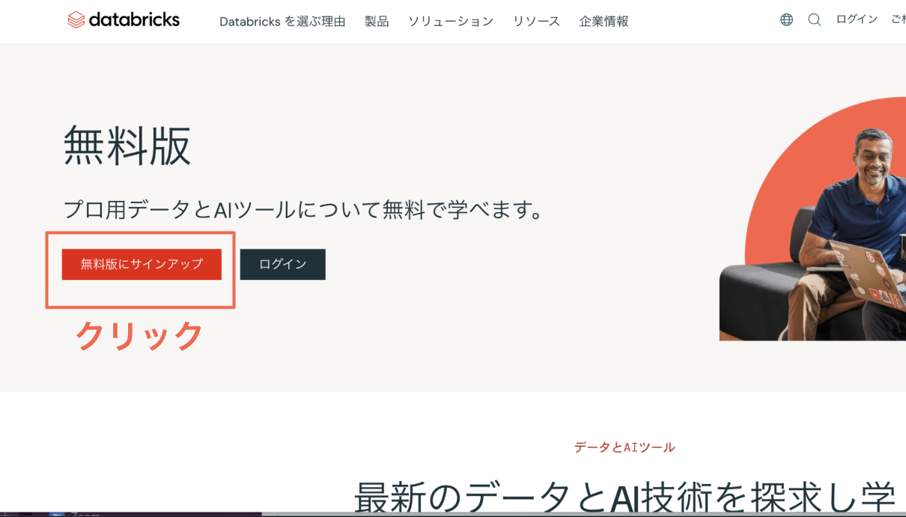
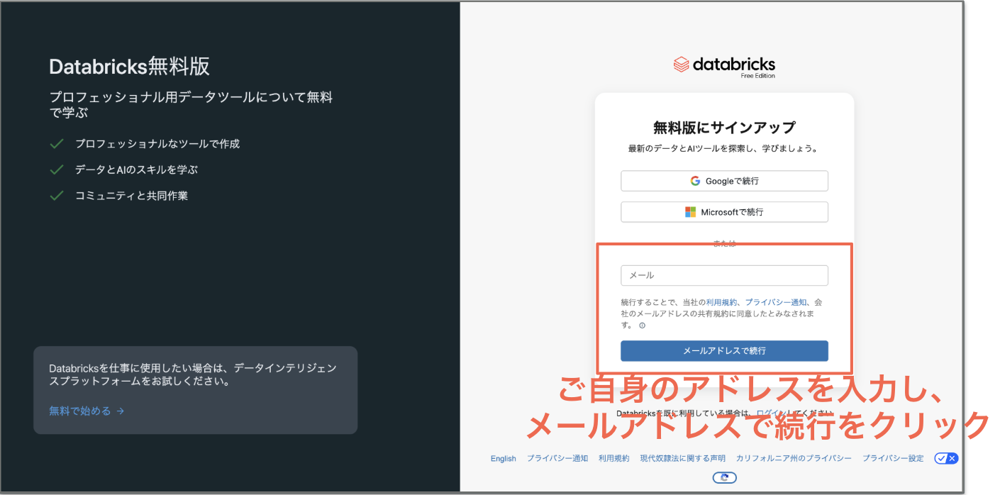
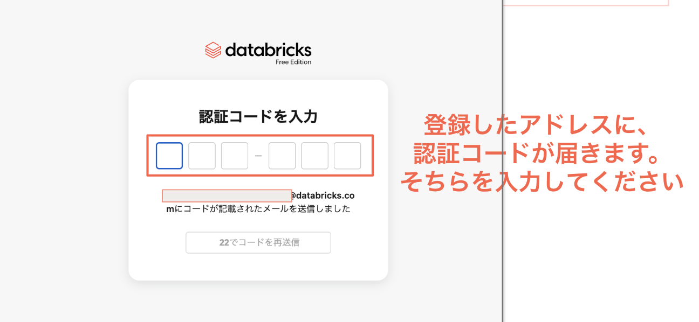
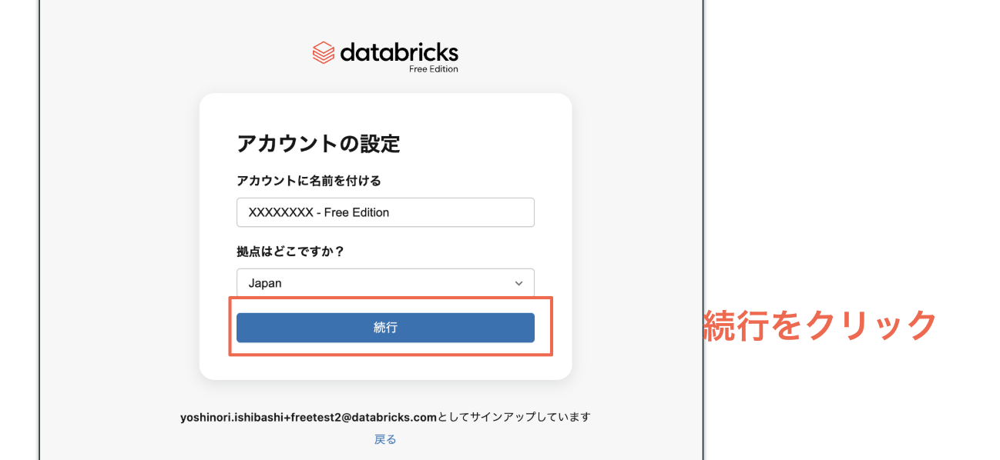
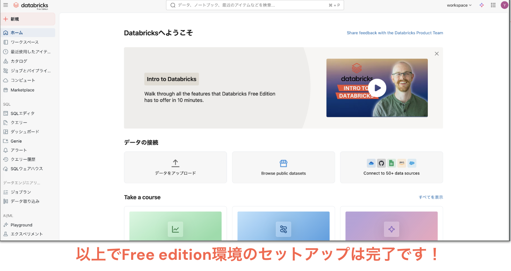
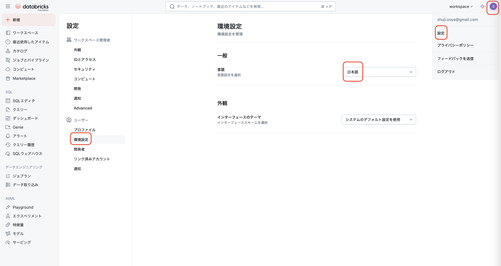
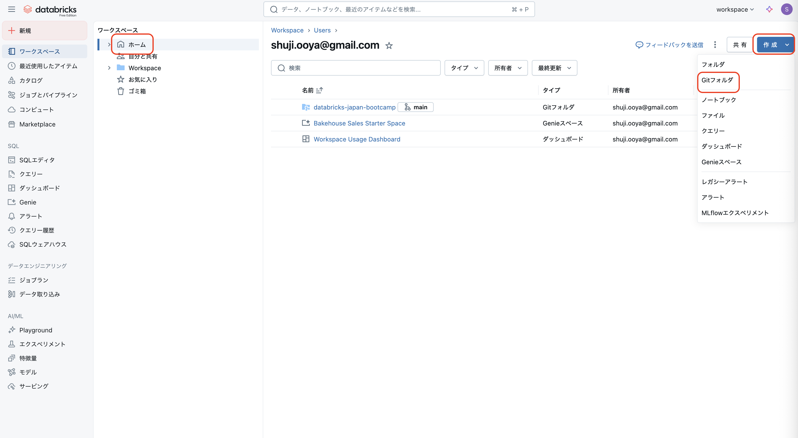
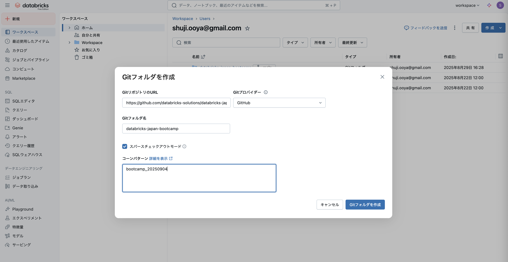

# ハンズオン環境セットアップ手順
ハンズオンの実施に必要な環境準備手順をご案内します。  
不明点がある場合は、遠慮なく講師にお尋ねください。

## Step 1: Free Edition環境への登録
ハンズオンではDatabricks Free Edition環境を使用します。  
[Databricks Free Editionの登録画面](https://www.databricks.com/jp/learn/free-edition)をブラウザで開きます。

1.**Free edition登録の画面にアクセス。**

 

2.**ご自身のメールアドレスを登録して、メールアドレスで続行を押します。**
- この画面のDatabricksのロゴの下に「Free edition」と小さく表示があるのを確認ください

 

3.**さきほど登録したメールアドレスに届いた認証コードを入力する。**
- 認証コードが来るまで1分ほどお待ちください

 

4.**拠点がJapanであることを確認しつつ、続行をクリック**
- お好みでアカウントの名前などを変更ください。（変更しなくても大丈夫です）
 

5.**Databricksのトップページが表示されれば、完了です！**
- 念の為、画面左上にあるDatabricksのロゴの下に「Free edition」と小さく表示があるのを確認ください

 

## Step 2: workspace環境の日本語化
Free Editionの登録時に、地域を日本と選択した方は、初期設定で言語は日本語になります。  
言語設定の変更が必要ない場合は、このステップはスキップしてください。

**言語設定の変更**
- [設定|Setting] > [環境設定|Preferences] > [言語|Language] を日本語に変更

## Step 3: Gitリポジトリのクローン
Free Edition環境のDatabricksワークスペースに本リポジトリをクローンします。

1. **Gitフォルダの作成**
    - [ホーム] > [作成] > [Gitフォルダ] を選択

2. **リポジトリ情報の入力**
    - 以下の設定でGitフォルダを作成してください。

    | 設定項目 | 設定値 |
    |---------|-------|
    | GitリポジトリのURL | `https://github.com/databricks-solutions/databricks-japan-bootcamp.git` |
    | Gitプロバイダー | `GitHub` |
    | Gitフォルダ名 | `databricks-japan-bootcamp` |
    | スパースチェックアウトモード | ✓（チェック） |
    | コーンパターン | `bootcamp_20260113` |

以上でハンズオンの準備は完了です。
