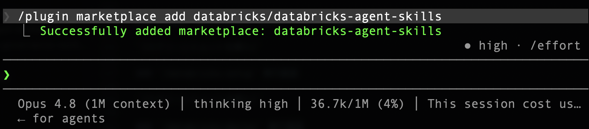
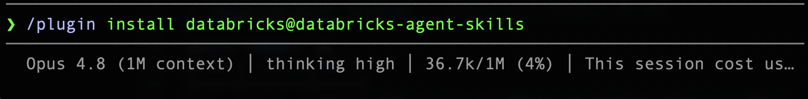
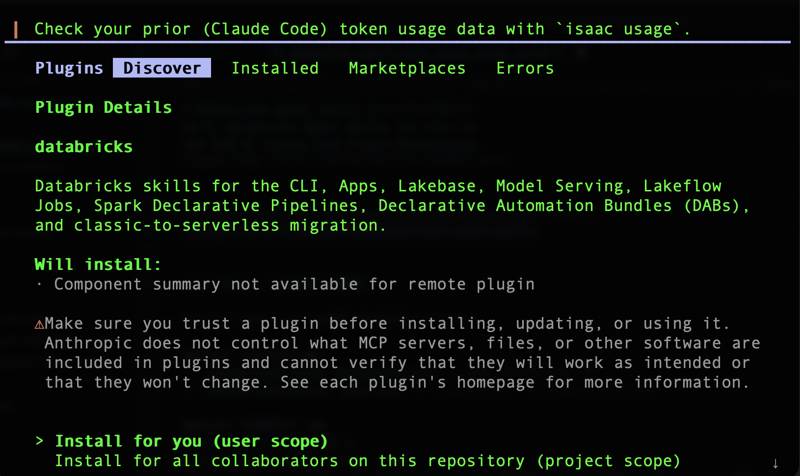
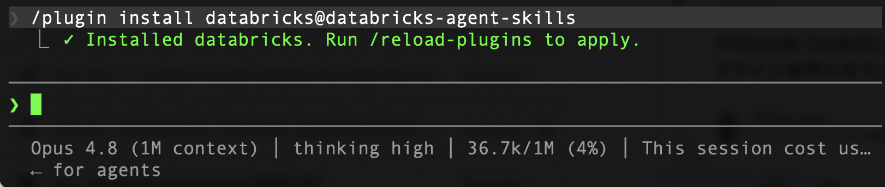
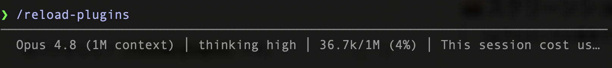
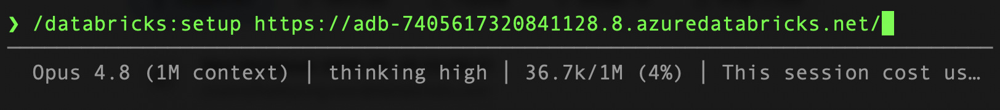
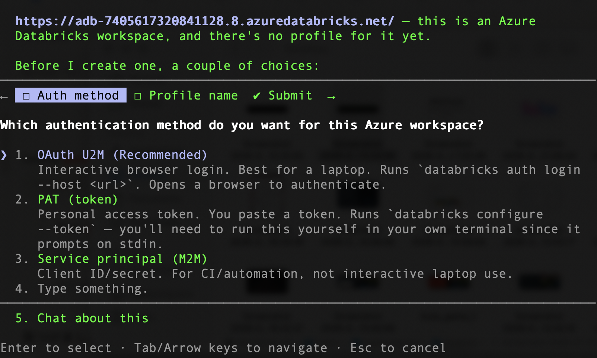
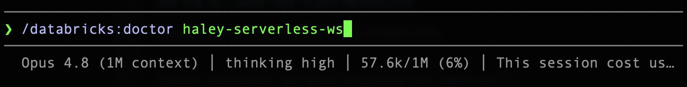
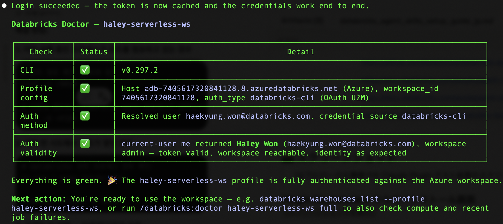
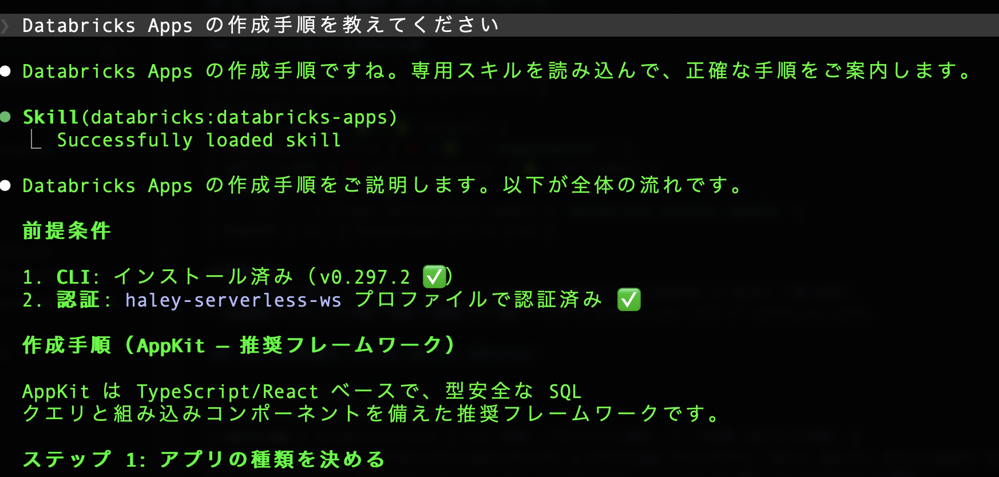

# Databricks Agent Skills セットアップガイド

**対象:** Claude Code / Cursor ユーザー向け

> **重要**: 旧 `ai-dev-kit` (databricks-solutions/ai-dev-kit) は **deprecated** となりました。  
> 本ガイドでは、旧環境のアンインストールと新しい **Databricks Agent Skills** のインストール手順を説明します。

## 1. 前提条件

以下が事前にインストール・設定されていることを確認してください。

| 項目 | バージョン | 確認コマンド |
|------|-----------|-------------|
| Databricks CLI | v1.0.0+ | `databricks --version` |
| Claude Code | 最新版 | `claude --version` |

### Databricks CLI の認証設定

```bash
# プロファイル設定（まだの場合）
databricks configure --profile <profile-name>

# 認証確認
databricks auth describe --profile <profile-name>
```

## 2. （オプション）ai-dev-kit のアンインストール

ai-dev-kitを事前にインストールしていた方は、スキルやMCPが競合する可能性があるため、削除をしてください。
事前に入れてない方はこの章をスキップいただき、３から実施ください。

> **注意**: ai-dev-kit はプロジェクトフォルダ単位でインストールされています。  
> 他の MCP サーバー設定には影響を与えないよう、ai-dev-kit 関連のエントリのみを削除します。

### 2.1 MCP サーバー設定から ai-dev-kit エントリを削除

ai-dev-kit は `.mcp.json`（プロジェクトルート）に MCP サーバーを登録しています。

**現在の設定を確認:**

```bash
cat .mcp.json
```

以下のような `"databricks"` エントリが ai-dev-kit によって追加されたものです。

```json
{
  "mcpServers": {
    "databricks": {
      "command": "/path/to/ai-dev-kit/.venv/bin/python",
      "args": ["/path/to/ai-dev-kit/repo/databricks-mcp-server/run_server.py"],
      "env": {"DATABRICKS_CONFIG_PROFILE": "<your-cli-profile-name>"}
    }
  }
}
```

**削除方法（いずれか）:**

#### 方法 A: Cursor の Settings UI から削除（推奨）

1. Cursor を開く
2. `Settings` → `MCP` を開く
3. ai-dev-kit の `"databricks"` エントリを削除

#### 方法 B: ファイルを直接編集

```bash
# エディタで開いて ai-dev-kit のエントリのみ削除
code .mcp.json   # VS Code / Cursor の場合
```

> **判別方法**: `args` に `/path/to/ai-dev-kit` や `databricks-mcp-server/run_server.py` が含まれているエントリが ai-dev-kit のものです。  
> 他の MCP サーバー（例: Databricks Managed MCP など）を使用している場合は、それは削除しないでください。

### 2.2 ai-dev-kit のクローンディレクトリを削除

```bash
# ai-dev-kit のクローンディレクトリを削除
rm -rf /path/to/ai-dev-kit/
```

## 3. Databricks Agent Skills のインストール

新しい `databricks-agent-skills` には **2つのインストール方法** があります。

### 3.1 方法 A: Claude Code Plugin Marketplace

Claude Code セッション内で以下のコマンドを実行します。

```
/plugin marketplace add databricks/databricks-agent-skills
/plugin install databricks@databricks-agent-skills
/reload-plugins
```

#### Plugin で追加される機能

Skills に加えて、以下の機能が利用可能になります。

**Slash Commands:**
- `/databricks:setup [workspace-url]` — 認証・オンボーディング
- `/databricks:doctor [profile]` — ヘルスチェック・トラブルシューティング

**Hooks（自動実行）:**

| Hook | トリガー | 機能 |
|------|---------|------|
| Prompt Router | プロンプト送信時 | Databricks関連プロンプトを自動検知、適切なスキルへ誘導 |
| Context Primer | セッション開始時 | CLIバージョン・プロファイル情報を自動注入 |
| Auth-failure Hint | ツール実行後 | 認証エラー時に自動ヒント提供 |

### 3.2 方法 B: Databricks CLI（canonical — Experimental スキルも利用可能）

```bash
# 全 Stable スキルをインストール（auto-detect で適切なエージェントに配置）
databricks aitools install

# 特定のスキルのみインストール
databricks aitools install databricks-apps

# Experimental スキルもインストール
databricks aitools install --experimental

# インストール済みスキル一覧
databricks aitools list

# アップデート
databricks aitools update

# アンインストール
databricks aitools uninstall
```

### 3.3 インストール方法の比較

| | Plugin Marketplace | Databricks CLI |
|---|---|---|
| Stable skills | ✅ | ✅ (default) |
| Experimental skills | ❌ | ✅ (`--experimental`) |
| 個別スキル選択 | ❌ (all-or-nothing) | ✅ (スキル名指定) |
| Commands & Hooks | ✅ | ❌ |
| アップデート | Plugin marketplace update | `databricks aitools update` |
| 前提条件 | なし | Databricks CLI v1.0.0+ |

**推奨:**
- **Claude Code ユーザー** → 方法 A（Plugin）がおすすめ。Commands & Hooks で最も便利。
- **複数エージェント利用・細かく制御したい** → 方法 B（Databricks CLI）が canonical path。

### 3.4 利用可能な Stable Skills（28スキル）

| カテゴリ | スキル名 | 説明 |
|---------|---------|------|
| **Core** | databricks-core | CLI、認証、プロファイル選択、データ探索（全スキルの親） |
| **AI & Agents** | databricks-agent-bricks | Knowledge Assistants, Genie Spaces, Multi-Agent Supervisor |
| | databricks-ai-functions | ai_query, ai_classify, ai_extract 等の SQL/PySpark AI関数 |
| | databricks-model-serving | Model Serving エンドポイント管理、AI Gateway |
| | databricks-vector-search | Vector Search エンドポイント＋インデックス（RAG用） |
| **Data Engineering** | databricks-pipelines | Lakeflow Spark Declarative Pipelines（旧DLT） |
| | databricks-jobs | Lakeflow Jobs オーケストレーション |
| **Analytics** | databricks-aibi-dashboards | AI/BI ダッシュボード（SQL検証ワークフロー付き） |
| | databricks-dbsql | Databricks SQL ウェアハウスパターン |
| **Apps** | databricks-apps | TypeScript/AppKit アプリ開発 |
| | databricks-apps-python | Python アプリ（Streamlit, Dash, Gradio, Flask, FastAPI） |
| | databricks-app-design | データアプリの UX デザイン |
| **Platform** | databricks-dabs | Declarative Automation Bundles（旧 Asset Bundles） |
| | databricks-lakebase | Lakebase Postgres: プロジェクト、ブランチ、Data API |
| | databricks-unity-catalog | Unity Catalog |
| | databricks-iceberg | Apache Iceberg テーブル |
| | databricks-serverless-migration | サーバーレス移行 |

## 4. インストール確認

### 4.1 Claude Code で確認

Claude Code セッション内で以下を実行します。

```
/databricks:doctor
```

または、スキルが認識されているか確認します。

```
Databricks Apps の作成手順を教えてください
```

→ `databricks-apps` スキルが適切にロードされていれば、ベストプラクティスに沿った回答が返ります。

### 4.2 インストール済みスキルの確認

```bash
# Databricks CLI 経由の場合
databricks aitools list
```

### 4.3 スクリーンショット

#### Plugin Marketplace からのインストール画面







#### `/databricks:setup` 実行画面




#### `/databricks:doctor` 実行画面




#### スキルが動作している様子


## 5. トラブルシューティング

| 問題 | 解決方法 |
|------|---------|
| `databricks: command not found` | Databricks CLI をインストール: `pip install databricks-cli` または brew |
| Plugin インストール後にスキルが認識されない | Claude Code を再起動してください |
| 認証エラー | `databricks auth describe` で有効なプロファイルか確認 |
| 旧 ai-dev-kit とスキルが競合する | セクション2の手順で `.mcp.json` から ai-dev-kit エントリを削除してください |
