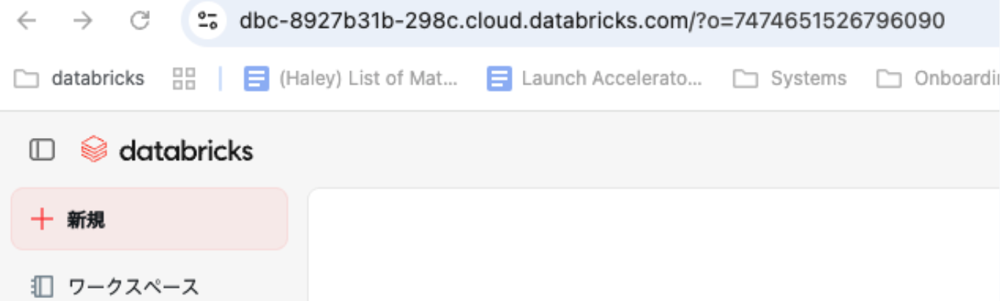

# Databricks AI Dev Kit インストールガイド

**対象:** Claude Code / Cursor ユーザー向け（Builder App ではなく、ローカル IDE 連携前提）  


## 1. 概要

Databricks AI Dev Kitは、Claude CodeやCursorなどのAIコーディングアシスタントに対して、Databricks 向けのベストプラクティスと実行ツール（MCP サーバー）を追加するためのキットです。  
このドキュメントでは、Claude Code / CursorにAI Dev Kitを導入するための手順に絞って説明します。

## 2. 前提条件

以下は、エンドユーザー PC（開発者のローカル環境）側で必要なものです。

### Databricks ワークスペース

例: `https://xxx.cloud.databricks.com`



### 認証情報

以下のいずれか。

- **Databricks CLI プロファイル**（`databricks configure` 済み）
- もしくは有効な **PAT（Personal Access Token）**（設定 → 開発者 → アクセストークン）

CLIプロファイルの例:

```bash
vi ~/.databrickscfg
```

### AIコーディングアシスタント

Claude CodeまたはCursorがローカルにインストールされていること。

### 推奨インストールスコープ

原則として、「**プロジェクトフォルダごと**」にAI Dev Kitをインストールします。  
そのフォルダを開いた状態でClaude Code / Cursorを利用すると、Databricks用 MCPツールが有効になります。

※ 管理部門で「標準開発環境」を配布する場合は、後述の「[5. MCP 設定のイメージ（.mcp.json 例）](#5-mcp-設定のイメージmcpjson-例)」を用いて共通テンプレートを配布することも可能です。

## 3. もっとも簡単な AI Dev Kit のインストール方法（推奨）

### 3.1 Mac / Linux

1. OS 上でターミナルを開き、任意の場所に**プロジェクトフォルダ**を作成します。
2. 作成したプロジェクトフォルダに移動します。
3. そのフォルダで、以下のコマンドを実行します。

```bash
bash <(curl -sL https://raw.githubusercontent.com/databricks-solutions/ai-dev-kit/main/install.sh)
```

このスクリプトは以下を自動で行います。

- GitHubからAI Dev Kitをダウンロード
- Databricksホストやプロファイル／トークンを対話的に設定
- Claude Code / Cursor 用MCPサーバー設定とスキルを構成
- デフォルトでは「実行したフォルダ（プロジェクトスコープ）」に設定を紐付け

**操作の目安**

- 使用したいツールを選択し、「Confirm」を選んで進めてください。（Space キー、矢印キー、Enter キーで操作可能）
- 使用するDatabricksプロファイルを選択します。
- インストールスコープを設定します。Projectレベルで進めます。
- スキルを選択できます。すべてのスキルで進めます。
- MCP Server locationを指定します。
- インストールを開始します。

インストールが完了したら、ClaudeやCursorでMCP設定を行います（[4. インストール後のMCP設定の確認](#4-インストール後の-mcp-設定の確認)を参照）。

### 3.2 Windows（PowerShell）

対象プロジェクトフォルダに移動したうえで、PowerShellから以下を実行します。

```powershell
irm https://raw.githubusercontent.com/databricks-solutions/ai-dev-kit/main/install.ps1 | iex
```

動作はMac / Linux版と同様で、Windows向けにPowerShellで同じ処理を行います。

### 3.3 インストールオプション

インストールスクリプトには、いくつかのオプションフラグがあります。

| フラグ | 説明 |
|--------|------|
| `--global` | マシン全体に対してグローバルインストール（全プロジェクトから利用） |
| `--tools cursor` | Cursor向けのツール設定のみを有効化 |
| `--force` | 既存の設定がある場合でも強制的に上書き |

**例（Cursor 専用でグローバルインストールする場合 / Mac / Linux）:**

```bash
bash <(curl -sL https://raw.githubusercontent.com/databricks-solutions/ai-dev-kit/main/install.sh) --global --tools cursor
```

## 4. インストール後の MCP 設定の確認

**Tools & MCPs** メニューから、Databricksのトグルが有効になっていることを確認します。

## 5. MCP 設定のイメージ（.mcp.json 例）

インストール完了後、Claude Code / CursorのMCP設定ファイル（例: `.mcp.json`）には、概ね以下のような設定が追加されます。

```json
{
  "mcpServers": {
    "databricks": {
      "command": "/path/to/ai-dev-kit/.venv/bin/python",
      "args": ["/path/to/ai-dev-kit/repo/databricks-mcp-server/run_server.py"],
      "env": {"DATABRICKS_CONFIG_PROFILE": "<your-cli-profile-name>"}
    }
  }
}
```

- `/path/to/ai-dev-kit` は、実際にAI Dev Kitをクローンしたパスに置き換えてください。
- 認証方法としてPAT を使う場合は、`DATABRICKS_TOKEN` を `env` に追加することもできます。
- 管理者が標準ファイルを配布するときは、このJSONをベースに、環境ごとのURLやプロファイル名だけ差し替える構成にすると運用しやすくなります。

## 6. Claude Code / Cursor からの動作確認

### 6.1 共通確認

1. 上記インストール手順を、Databricks作業用プロジェクトフォルダで実行する。
2. そのフォルダを開いた状態でClaude Code / Cursorを起動する。
3. MCP サーバー一覧またはツール一覧に、以下のような Databricks用ツールが表示されていることを確認する。  
   例: `execute_sql`、`ask_genie`、`manage_mas`、`manage_ka`、`query_vs_index` など。

### 6.2 プロンプトテスト（サンプルテーブル＋ Genie スペース作成例）

以下の手順で、AI Dev Kit から Databricksに正しく接続できているかを確認します。以下のプロンプトなどを参考に、自由にテストを行ってください。

**プロンプト例**（コピー用）

```text
このワークスペースで利用可能なカタログを確認した上で、
カタログ「x」、スキーマ「y」にサンプル用の売上テーブルを 1 つ作成してください。

テーブル名は `sample_sales` とし、主なカラムは
- `order_date`（日付）
- `department`（部署名）
- `revenue`（金額, DOUBLE）
としてください。簡単なダミーデータも数十行ほど挿入してください。

そのうえで、この `sample_sales` テーブルをデータソースとして、
「Sample Sales Analytics」という名前の Genie スペースを 1 つ作成し、
月次売上や部署別売上を分析しやすいように、日本語のサンプル質問を 3〜5 個登録してください。

最後に、作成した Genie スペースの名前と、登録したサンプル質問の一覧を教えてください。
```

（結果は環境により異なります。）

## 7. トラブルシューティング

### 7.1 インストールスクリプト実行時のエラー

AI Dev Kit Onboardingドキュメントでは、以下のようなエラーと対処方法がまとまっています。

| エラー例 | 対処方法 |
|----------|----------|
| `uvicorn: command not found` | `source .venv/bin/activate` で仮想環境を有効化してから再実行 |
| Databricks アクセストークンのエラー | PAT を再発行し、再度インストールスクリプトから設定 |
| Databricks テーブルへのアクセス拒否 | Lakehouse／Lakebase 側で権限付与（テーブルやスキーマに対する `GRANT`） |

### 7.2 MCP ツールがエディタ側に表示されない

- インストールコマンドを実行した**フォルダと異なるパス**で Claude / Cursor を起動していないか確認してください（プロジェクトスコープの場合）。
- `.mcp.json` に `databricks` サーバーの設定が入っているか確認します。
- `DATABRICKS_HOST` と `DATABRICKS_CONFIG_PROFILE` または `DATABRICKS_TOKEN` が正しいか確認してください。

## 8. Appendix

### 8.1 テンプレート化したAI Dev Kitを配布したい場合（管理者想定）

AI Dev Kit を利用した開発環境を自社用にカスタマイズしたい、もう少し制御したい、社内標準の開発環境テンプレートを作りたい、といった場合は、リポジトリを明示的にクローンして編集などを行ったうえで `install.sh` を実行する形も取れます。

```bash
git clone https://github.com/databricks-solutions/ai-dev-kit.git
cd ai-dev-kit

# Claude Code / Cursor 用 MCP 設定も含めてインストール
bash install.sh
```

Databricks ワークスペースとの接続には、環境変数で以下を指定します。

```bash
export DATABRICKS_HOST="https://xxx.cloud.databricks.com"
export DATABRICKS_CONFIG_PROFILE="<your-cli-profile-name>"
# もしくは DATABRICKS_TOKEN を利用
```

このパターンでは、`.mcp.json` などのMCP設定ファイルに、前述のようなエントリが自動生成されます。
