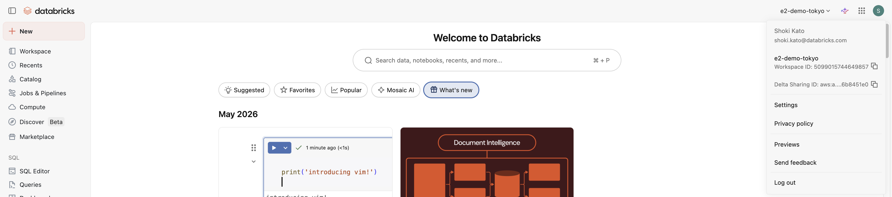
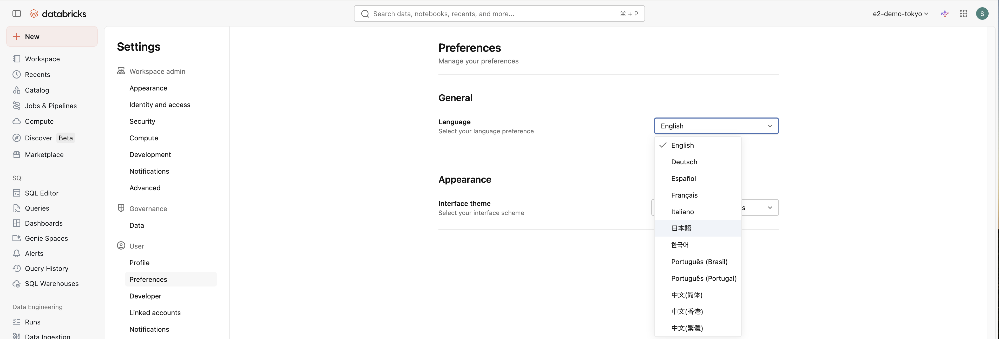
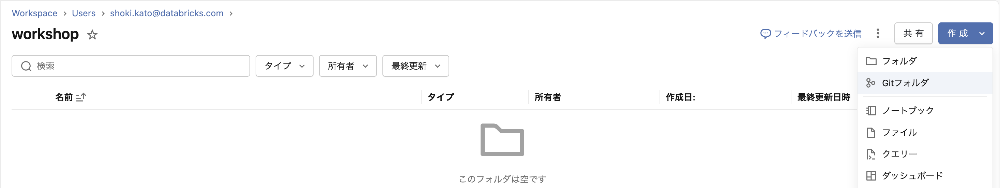
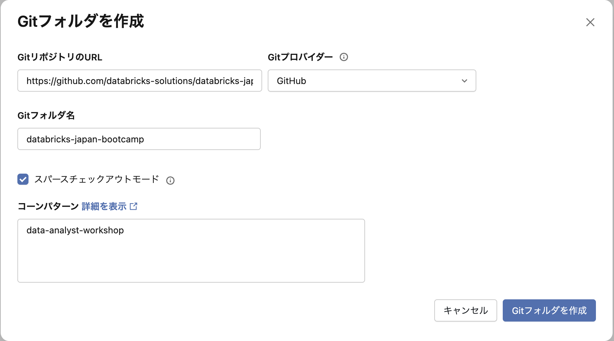
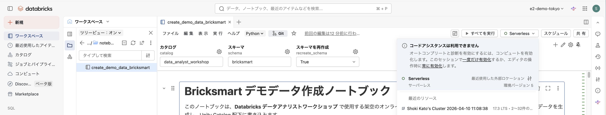
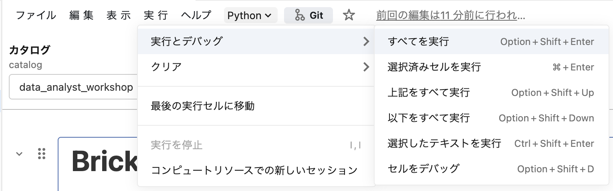

# Databricks データアナリストワークショップ 環境セットアップガイド

本リポジトリは、Databricksのデータアナリスト向け機能（AI/BI Dashboard, Genie Spaces）を体験するためのワークショップ用素材です。本 README は、ワークショップ実施に必要な環境セットアップ手順をまとめています。

## 本資料の構成

| セクション | 対象 | 所要時間 |
| --- | --- | --- |
| [Part 1: ワークショップ環境セットアップ担当者向けガイド](#part-1-ワークショップ環境セットアップ担当者向けガイド) | ワークショップを開催・運営する担当者 | 30分〜1時間 |
| [Part 2: ワークショップ参加者向け事前作業ガイド](#part-2-ワークショップ参加者向け事前作業ガイド) | ワークショップに参加する利用者 | 約5分 |

ご自身の役割に応じて、該当するセクションをご参照ください。

## 前提となるリソース命名

本ガイドでは以下の名前で各リソースを作成します（変更可能）。

| 種別 | 名前 |
| --- | --- |
| グループ | `data_analyst_workshop_group` |
| カタログ | `data_analyst_workshop` |
| スキーマ | `bricksmart` |
| サンプルテーブル | `users`, `products`, `transactions` ほか |

---

# Part 1: ワークショップ環境セットアップ担当者向けガイド

セットアップ担当者が以下の作業を実施します。所要時間は **30分〜1時間** です。

実施項目（チェックリスト）:

- [ ] 1. Databricks ワークスペースの準備（以下から1つ選択）
  - 既存ワークスペースの利用（Azure / AWS / GCP）
  - 新規ワークスペースの作成（Azure Databricks）
  - 新規ワークスペースの作成（Databricks on AWS）
  - 新規ワークスペースの作成（Databricks on GCP）
- [ ] 2. 表示言語を日本語に変更（オプション）
- [ ] 3. ワークショップ用グループの作成
- [ ] 4. ユーザーをワークスペースに招待
- [ ] 5. グループへのユーザー追加
- [ ] 6. カタログの新規作成（オプション）
- [ ] 7. サンプルテーブルの作成
- [ ] 8. サンプルテーブルの確認

---

## 1. Databricks ワークスペースの準備

以下の 4 つの方法から、利用可能なクラウド環境に応じて 1 つを選択してください。

### Option 1: 既存ワークスペースの利用

以下のすべての要件を満たしていることを確認してください。

- セットアップ実施者が **ワークスペース管理者** の権限を持っていること（グループの作成・ユーザー招待のため）
- **Unity Catalog が有効化** されたワークスペースであること
- **カタログの新規作成が可能**、あるいはワークショップに利用可能な **既存のカタログ** があること

### Option 2: 新規ワークスペースの作成（Azure Databricks）

Azure ポータルから作成します。

**前提条件:**

- 無料試用版**ではない** Azure サブスクリプションを持っていること
- Azure サブスクリプションの **所有者** または **共同作成者** の権限を持っていること
- Azure サブスクリプションが信頼する Entra ID テナントと、ワークショップ参加ユーザーが所属する Entra ID テナントが同一であること

**作成時のポイント:**

- 価格レベルは **Premium** または **試用版** を選択
- 価格レベル以外は特別な要件なし（デフォルト/任意の設定で OK）

**参考ドキュメント:**

- [Azure Databricks のチュートリアルを開始する — Microsoft Learn](https://learn.microsoft.com/ja-jp/azure/databricks/getting-started/)
- [Azure Databricks 無料試用版 — Microsoft Learn](https://learn.microsoft.com/ja-jp/azure/databricks/getting-started/free-trial)

### Option 3: 新規ワークスペースの作成（Databricks on AWS）

以下のいずれかの方法でワークスペースを作成します。

#### 3-a. Express Setup（推奨）

- AWS アカウントとの接続は **不要**、SaaS ライクに数分で開始できる
- **サーバーレスコンピューティング** が利用可能
- **$400 のクレジット** が利用可能

#### 3-b. 無料トライアル

- AWS アカウントとの接続が **必要**
- **クラシックコンピューティング** が利用可能
- サーバーレスコンピューティングを利用するためには、無料トライアルからアップグレードが必要
- 無料トライアルでは DBU（Databricks Unit）料金が無料
- AWS アカウントで発生するコンピューティングやストレージなどの料金は、お客様にて負担

**参考ドキュメント:**

- [エクスプレスセットアップで Databricks にサインアップする — Databricks on AWS](https://docs.databricks.com/aws/ja/getting-started/express-setup)
- [Databricksに無料で登録する — Databricks on AWS](https://docs.databricks.com/aws/ja/getting-started/free-trial)

### Option 4: 新規ワークスペースの作成（Databricks on GCP）

無料トライアルでワークスペースを作成します。

- **Google Cloud アカウントとの接続が必要**
- 無料トライアルでは DBU（Databricks Unit）料金が無料
- Google Cloud アカウントで発生するコンピューティングやストレージなどの料金は、お客様にて負担

**参考ドキュメント:**

- [Databricksに無料で登録する — Databricks on Google Cloud](https://docs.databricks.com/gcp/ja/getting-started/free-trial)
- [Google Cloud で Databricks フリートライアルを始める — Databricks on Google Cloud](https://docs.databricks.com/gcp/ja/admin/account-settings-gcp/create-subscription)

---

## 2. 表示言語を日本語に変更（オプション）

1. 画面右上のユーザーアイコンをクリックし、**Settings** をクリック



2. **Preferences**（設定）タブから **Language** を **日本語** に変更



3. ページが自動更新され、UI が日本語表示になることを確認

> 以降の手順では、UI 表記は日本語前提で記述しています。

**参考ドキュメント:**

- [ワークスペースの外観設定を管理する — Databricks on AWS](https://docs.databricks.com/aws/ja/admin/workspace-settings/appearance)
- [ワークスペースの外観設定の管理 — Microsoft Learn](https://learn.microsoft.com/ja-jp/azure/databricks/admin/workspace-settings/appearance)

---

## 3. ワークショップ用グループの作成

1. 画面右上のユーザーアイコンをクリックし、**設定** をクリック
2. **IDとアクセス** > **グループの管理** をクリック
3. **グループを追加** > **新規追加** をクリック
4. 新しいグループ名に `data_analyst_workshop_group` を入力し、**追加** をクリック

**参考ドキュメント:**

- [グループの管理 — Databricks on AWS](https://docs.databricks.com/aws/ja/admin/users-groups/manage-groups)
- [グループの管理 — Microsoft Learn](https://learn.microsoft.com/ja-jp/azure/databricks/admin/users-groups/manage-groups)
- [グループの管理 — Databricks on Google Cloud](https://docs.databricks.com/gcp/ja/admin/users-groups/manage-groups)

---

## 4. ユーザーをワークスペースに招待

1. 設定画面で **IDとアクセス** > **ユーザーの管理** をクリック
2. **ユーザーを追加** > **新規追加** をクリック
3. 招待するユーザーのメールアドレスを入力し、**追加** をクリック

**招待メールの挙動について:**

| クラウド | 招待メール |
| --- | --- |
| Databricks on AWS | ユーザーに招待メールが **送信される** |
| Azure Databricks | ユーザーに招待メールは **送信されない**（ワークスペース URL を別途共有してください） |

**参考ドキュメント:**

- [ユーザーの管理 — Databricks on AWS](https://docs.databricks.com/aws/ja/admin/users-groups/users)
- [ユーザーの管理 — Microsoft Learn](https://learn.microsoft.com/ja-jp/azure/databricks/admin/users-groups/users)

---

## 5. グループへのユーザー追加

1. 設定画面で **IDとアクセス** から、作成した `data_analyst_workshop_group` をクリック
2. **メンバーを追加** をクリック
3. ユーザーのメールアドレスを数文字入力すると候補が表示されるので選択（一度の操作で複数ユーザーをまとめて追加可能）
4. **追加** をクリック
5. グループに必要なユーザー群が表示されていることを確認

**参考ドキュメント:**

- [グループの管理（メンバー管理） — Databricks on AWS](https://docs.databricks.com/aws/ja/admin/users-groups/manage-groups)

---

## 6. カタログの新規作成（オプション）

既存のカタログを利用する場合はスキップ可能です。

### 6-1. カタログを追加

1. サイドバーの **カタログ** を開く
2. **+** ボタン > **カタログを追加** をクリック
3. カタログ名に `data_analyst_workshop` を入力し **作成** をクリック
4. **カタログを表示** をクリック

> **注意（AWS Express Setup の場合）:** ワークスペース作成直後は **カタログを追加** が表示されないことがあります。**ワークスペース作成から 10〜15 分** ほど経過すると表示されるはずなので、しばらく待ってから再度お試しください。

### 6-2. カタログに権限を付与

1. 作成したカタログの **権限** タブにアクセスし **付与** をクリック
2. プリンシパルに `data_analyst_workshop_group` を入力
3. 権限プリセットに **ALL PRIVILEGES** をチェック
4. **付与** をクリック
5. `data_analyst_workshop_group` に `ALL PRIVILEGES` が付与された状態になっていれば OK

**参考ドキュメント:**

- [Unity Catalog の権限を管理する — Databricks on AWS](https://docs.databricks.com/aws/ja/data-governance/unity-catalog/manage-privileges/)
- [Unity Catalog の権限の管理 — Microsoft Learn](https://learn.microsoft.com/ja-jp/azure/databricks/data-governance/unity-catalog/manage-privileges/)
- [Unity Catalog の権限を管理する — Databricks on Google Cloud](https://docs.databricks.com/gcp/ja/data-governance/unity-catalog/manage-privileges/)

---

## 7. サンプルテーブルの作成

本リポジトリの `notebook/create_demo_data_bricksmart.ipynb` を Databricks ワークスペースに取り込み、実行します。

### 7-1. リポジトリを Git フォルダとして取り込む

1. サイドバーの **ワークスペース** > **作成** > **Git フォルダ** をクリック



2. Git リポジトリの URL に以下を貼り付け
   ```
   https://github.com/databricks-solutions/databricks-japan-bootcamp
   ```
3. **スパースチェックアウトモード** にチェックを入れ、**コーンパターン** に以下を貼り付け
   ```
   data-analyst-workshop
   ```



4. **Git フォルダを作成** をクリック

### 7-2. ノートブックを開く

1. 作成された Git フォルダ配下で `data-analyst-workshop` > `notebook` を開く
2. `create_demo_data_bricksmart` をクリック

### 7-3. ノートブックを実行

1. 右上の **接続** をクリックし **サーバーレス** を選択
   - ※ 非サーバーレスのクラスターでも本ノートブックは実行可能です



2. **1 つ目のセル** を実行
   - 初回実行時、通知の表示を求めるダイアログが出る場合は **許可** する
3. ウィジェットが表示されるので、**カタログ** に作成したカタログ名（例: `data_analyst_workshop`）を入力
4. 上部メニューの **すべてを実行** をクリック



5. 一番下までスクロールし、すべてのセルが正常終了（✔︎）していることを確認

**参考ドキュメント:**

- [Git フォルダの作成と管理 — Databricks on AWS](https://docs.databricks.com/aws/ja/repos/git-operations-with-repos)
- [Sparse checkout in Git folders — Databricks Blog](https://www.databricks.com/blog/2023/01/26/work-large-monorepos-sparse-checkout-support-databricks-repos.html)
- [ノートブック用サーバーレスコンピュート — Databricks on AWS](https://docs.databricks.com/aws/ja/compute/serverless/notebooks)
- [Databricks ウィジェット — Databricks on AWS](https://docs.databricks.com/aws/ja/notebooks/widgets)

---

## 8. サンプルテーブルの確認

手順 7 で取り込んだ Git フォルダの `query/` 配下にある SQL ファイルをワークスペース上で直接開き、テーブルが正しく作成されていることを確認します。

### 8-1. ローデータを確認

1. サイドバーの **ワークスペース** から `databricks-japan-bootcamp` > `databricks-data-analyst-workshop` > `query` を開く
2. `ローデータ確認.sql` をクリックして開く
3. 右上の **SQL ウェアハウス** を選択（起動していない場合は自動起動するまで待機）
4. **すべて実行** をクリック

`users` / `products` / `transactions` の 3 テーブルからそれぞれ 10 件ずつ表示されれば OK です。

### 8-2. 集計クエリを実行

`query/` 配下の以下 2 本の SQL ファイルも、同様に開いて **すべて実行** をクリックします。

- `性別・商品カテゴリ別売上高・比率.sql`  
  性別 × 商品カテゴリでの売上高と、性別ごとの売上比率（%）を算出
- `地域・商品カテゴリ別売上高・比率.sql`  
  地域 × 商品カテゴリでの売上高と、地域ごとの売上比率（%）を算出

いずれもエラーなく結果が表示されれば、ワークショップで利用するデータが正しく揃っている状態です。

> **補足:** Catalog Explorer から `data_analyst_workshop.bricksmart` 配下のテーブルをブラウザで直接プレビューしたい場合は、テーブル詳細画面の **サンプルデータ** タブで **コンピュートを選択** > **開始して閉じる** を選んでも内容を確認できます。

**参考ドキュメント:**

- [ワークスペースで SQL ファイルを操作する — Databricks on AWS](https://docs.databricks.com/aws/ja/files/workspace)
- [新しい SQL エディタでクエリを記述してデータを探索する — Databricks on AWS](https://docs.databricks.com/aws/ja/sql/user/sql-editor/)
- [カタログエクスプローラとは — Databricks on AWS](https://docs.databricks.com/aws/ja/catalog-explorer/)

---

# Part 2: ワークショップ参加者向け事前作業ガイド

ワークショップ参加者は以下の事前作業を実施してください。所要時間は **約 5 分** です。

担当者からの指示に基づき、以下のいずれかの方法でログインを試してください。

| 利用するクラウド | 認証方式 | 参照節 |
| --- | --- | --- |
| Databricks on AWS / GCP | 電子メールによるワンタイムパスコード認証 | [A. AWS / GCP](#a-databricks-on-aws--gcp電子メールワンタイムパスコード認証) |
| Azure Databricks | Microsoft Entra ID 認証 | [B. Azure](#b-azure-databricksentra-id-認証) |

> ※ 上記以外の認証方式を利用する場合、担当者から別途具体的な方法が指示されます。

---

## A. Databricks on AWS / GCP（電子メールワンタイムパスコード認証）

1. **招待メールを確認**  
   招待メールの **Join now** をクリック。メールが見当たらない場合は迷惑メールボックスをご確認ください。
2. **電子メールでログイン**  
   自身のメールアドレスを入力し、**Continue with email** をクリック
3. **認証コードを確認**  
   メールで認証コードが届くのでコピー
4. **認証コードでログイン**  
   元のログイン画面に戻り、認証コードを貼り付け
5. **トップページに遷移**  
   Databricks ワークスペースのトップページが表示されれば OK（ブラウザのタブはそのまま閉じて問題ありません）

---

## B. Azure Databricks（Entra ID 認証）

1. **ワークスペース URL にアクセス**  
   担当者から共有されたワークスペース URL にアクセスし、**Microsoft Entra ID でサインイン** をクリック
2. **Entra ID 認証を実施**  
   Entra ID の認証フローに従ってサインイン  
   ※ ブラウザで既に Entra ID 認証済の場合、追加の認証は要求されません
3. **トップページに遷移**  
   Databricks ワークスペースのトップページが表示されれば OK（ブラウザのタブはそのまま閉じて問題ありません）

---

# 付録

## A. ディレクトリ構成

```
databricks-data-analyst-workshop/
├── README.md                                    ← 本ファイル
├── notebook/
│   └── create_demo_data_bricksmart.ipynb        ← サンプルテーブル作成ノートブック
└── query/
    ├── ローデータ確認.sql
    ├── メトリクスビューのクエリ.sql
    ├── 性別・商品カテゴリ別売上高・比率.sql
    └── 地域・商品カテゴリ別売上高・比率.sql
```

## B. 参考リンク（公式ドキュメント横断）

- [Databricks ドキュメント（AWS）](https://docs.databricks.com/aws/ja/)
- [Databricks ドキュメント（Google Cloud）](https://docs.databricks.com/gcp/ja/)
- [Azure Databricks ドキュメント（Microsoft Learn）](https://learn.microsoft.com/ja-jp/azure/databricks/)
- [Databricks の入門チュートリアル](https://docs.databricks.com/aws/ja/getting-started/)
