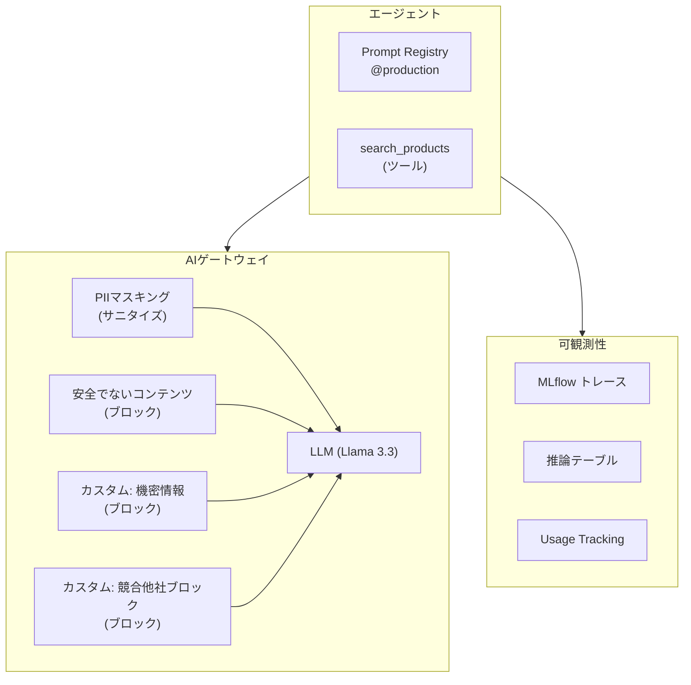

# 概要

Databricks上で**AIガードレール**と**プロンプト管理**を実装するワークショップのハンズオンです。ガードレール付きAIゲートウェイエンドポイントの作成から、簡易エージェントの構築、トレースによる可観測性、Prompt Registryでのプロンプト管理までを一気通貫で実践します。

| # | セクション | 内容 | 時間 |
|---|-----------|------|------|
| 1 | AIゲートウェイとガードレール | エンドポイント作成、ビルトイン+カスタムガードレール設定・検証 | 25分 |
| 2 | 簡易エージェントの構築 | ガードレール付きエンドポイントで商品検索エージェントを構築 | 15分 |
| 3 | トレースによる可観測性 | エージェントの動作をMLflowトレースで可視化、トークン使用量の確認 | 10分 |
| 4 | プロンプトの登録・バージョン管理 | エージェントのプロンプトをPrompt Registryで管理・デプロイ制御 | 15分 |
| 5 | まとめ・次のステップ | 推論テーブル・Usage Trackingの紹介、振り返り | 5分 |

## 前提条件

- Databricksワークスペースへのアクセス権限
- Unity AIゲートウェイ(Beta)がAccount Console Previewsで有効化済み
- MLflow Prompt Registry(Beta)がWorkspace Previewsで有効化済み

プレビュー機能の有効化・カタログ作成・権限設定の詳細な手順は、後述の「事前準備」を参照してください。

## 構成図

このハンズオンで構築するシステムの全体像です。



## カスタマイズ

ノートブック冒頭の設定変数(セクション0.1)を変更することで、任意の企業・業種向けにカスタマイズできます。

```python
# 自社名
COMPANY_NAME = "サンプル株式会社"

# 競合他社リスト(カスタムガードレールで使用)
COMPETITORS = ["A社", "B社", "C社"]

# ダミーの商品/サービスデータ(エージェントのツールで使用)
PRODUCT_DATA = {
    "プレミアムプラン": {"月額": "9,800円", "内容": "全機能利用可能", "特徴": "フルサポート付き"},
    "スタンダードプラン": {"月額": "4,980円", "内容": "主要機能利用可能", "特徴": "コストパフォーマンス重視"},
    "ライトプラン": {"月額": "1,980円", "内容": "基本機能のみ", "特徴": "ライトユーザー向け"},
}

# カスタムガードレールで検出する機密情報の種類
SENSITIVE_INFO_NAME = "マイナンバー"
SENSITIVE_INFO_GUARDRAIL_NAME = "block_my_number"
```

# 事前準備

ワークショップ当日までに、管理者側で以下の準備を実施してください。

## プレビュー機能の有効化

以下の2つのプレビュー機能を有効化します。

| 機能 | 有効化場所 | 操作者 |
|------|-----------|--------|
| AI Gateway V2 Preview(Beta) | Account Console > プレビュー | アカウント管理者 |
| Managed MLflow Prompt Registry(Beta) | ワークスペースのユーザーアイコン > プレビュー | ワークスペース管理者 |

- **Account Console**: アカウントコンソールにログインし、左メニューの「プレビュー」から該当機能を検索して有効化してください
- **Workspace Settings**: ワークスペース右上の「ユーザーアイコン」>「プレビュー」から該当機能を有効化してください

## カタログ・スキーマの作成と権限設定

ハンズオンではUnity Catalogのカタログ・スキーマを使用します。以下のSQLをDatabricks SQLエディタまたはノートブックで実行してください。カタログ・スキーマ名を変更する場合は、ノートブックの設定変数(セクション0.1の`CATALOG`、`SCHEMA`)も合わせて修正してください。

**カタログ・スキーマの作成**

```sql
CREATE CATALOG IF NOT EXISTS workshop;
CREATE SCHEMA IF NOT EXISTS workshop.llmops;
```

**参加者への権限付与**

`<参加者グループ>`は実際のグループ名に置き換えてください(例: workshop_participants)。

```sql
-- カタログ・スキーマへのアクセス
GRANT USE CATALOG ON CATALOG workshop TO `<参加者グループ>`;
GRANT USE SCHEMA ON SCHEMA workshop.llmops TO `<参加者グループ>`;

-- Prompt Registry用(プロンプトはUnity Catalog関数として保存されます)
GRANT CREATE FUNCTION ON SCHEMA workshop.llmops TO `<参加者グループ>`;
GRANT EXECUTE ON SCHEMA workshop.llmops TO `<参加者グループ>`;

-- 推論テーブル用(AIゲートウェイのペイロードログ保存先)
GRANT CREATE TABLE ON SCHEMA workshop.llmops TO `<参加者グループ>`;
```

**権限の用途一覧**

| 権限 | 対象 | 用途 |
|------|------|------|
| USE CATALOG | workshopカタログ | カタログへのアクセス |
| USE SCHEMA | workshop.llmopsスキーマ | スキーマへのアクセス |
| CREATE FUNCTION | workshop.llmopsスキーマ | Prompt Registry(プロンプト登録) |
| EXECUTE | workshop.llmopsスキーマ | Prompt Registry(プロンプト読み込み) |
| CREATE TABLE | workshop.llmopsスキーマ | 推論テーブル(ペイロードログ) |

## 参加者のワークスペースアクセス

参加者がDatabricksワークスペースにログインできることを確認してください。

## ノートブックの配布

ハンズオン用ノートブック(LLMOps_ハンズオン.py)をDatabricksワークスペースにアップロードし、参加者がアクセスできる共有フォルダに配置するか、各自のホームディレクトリにコピーしてください。

# 0. 環境セットアップ

必要なライブラリをインストールします。

```python
%pip install -U openai "mlflow[databricks]>=3.1.0" databricks-sdk
dbutils.library.restartPython()
```

## 0.1 設定変数

ワークショップ全体で使用する変数を定義します。カタログ・スキーマ名、企業情報は環境に合わせて変更してください。

```python
# ========== ワークショップ設定 ==========

# カタログ・スキーマ(環境に合わせて変更してください)
CATALOG = "workshop"
SCHEMA = "llmops"

# AIゲートウェイエンドポイントで使用するモデル名
MODEL_NAME = "databricks-meta-llama-3-3-70b-instruct"

# ---------- 企業固有の設定(ここを変更すれば他社でも利用可能) ----------

# 自社名
COMPANY_NAME = "サンプル株式会社"

# 競合他社リスト(カスタムガードレールで使用)
COMPETITORS = ["A社", "B社", "C社"]

# ダミーの商品/サービスデータ(エージェントのツールで使用)
PRODUCT_DATA = {
    "プレミアムプラン": {"月額": "9,800円", "内容": "全機能利用可能", "特徴": "フルサポート付き"},
    "スタンダードプラン": {"月額": "4,980円", "内容": "主要機能利用可能", "特徴": "コストパフォーマンス重視"},
    "ライトプラン": {"月額": "1,980円", "内容": "基本機能のみ", "特徴": "ライトユーザー向け"},
}

# カスタムガードレールで検出する機密情報の種類
SENSITIVE_INFO_NAME = "マイナンバー"
SENSITIVE_INFO_DESCRIPTION = "マイナンバー(個人番号)"

# ガードレール名(英数字・ハイフン・アンダースコアのみ使用可能)
SENSITIVE_INFO_GUARDRAIL_NAME = "block_my_number"

# ==========================================

print(f"企業名: {COMPANY_NAME}")
print(f"競合他社: {', '.join(COMPETITORS)}")
print(f"商品数: {len(PRODUCT_DATA)}件")
```

参加者ごとのユニーク識別子とエンドポイント名を自動生成します。

```python
# 参加者ごとのユニーク識別子(メールアドレスのローカル部分から自動生成)
USERNAME = (
    spark.sql("SELECT current_user()").first()[0]
    .split("@")[0]
    .replace(".", "_")
    .replace("-", "_")
)

# 参加者専用のAIゲートウェイエンドポイント名(参加者間で競合しない)
ENDPOINT_NAME = f"ws_{USERNAME}"

print(f"ユーザー名: {USERNAME}")
print(f"エンドポイント名: {ENDPOINT_NAME}")
print(f"モデル: {MODEL_NAME}")
print(f"カタログ.スキーマ: {CATALOG}.{SCHEMA}")
```

## 0.2 クライアントの初期化

Unity AIゲートウェイのエンドポイントは、従来の`/serving-endpoints`ではなく`/ai-gateway/mlflow/v1`をベースURLとして使用します。OpenAI互換のSDKでそのままアクセスできます。

参考: [AIゲートウェイエンドポイントのクエリ](https://docs.databricks.com/ja/ai-gateway/query-endpoints-beta)

```python
from openai import OpenAI
import mlflow
import json
import textwrap

# ワークスペースのホスト名と認証トークンを取得
_host = spark.conf.get("spark.databricks.workspaceUrl")
_token = (
    dbutils.notebook.entry_point.getDbutils()
    .notebook()
    .getContext()
    .apiToken()
    .get()
)

# AIゲートウェイ向けのOpenAI互換クライアント
client = OpenAI(
    api_key=_token,
    base_url=f"https://{_host}/ai-gateway/mlflow/v1",
)

# MLflowトレーシングの有効化(以降のLLM呼び出し・@mlflow.traceデコレータがすべて記録される)
_current_user = spark.sql("SELECT current_user()").first()[0]
mlflow.set_experiment(f"/Users/{_current_user}/llmops_workshop")
mlflow.set_registry_uri("databricks-uc")
mlflow.tracing.enable()

# OpenAIクライアントの自動計装(各LLM呼び出しのスパンにトークン使用量が自動記録される)
mlflow.openai.autolog()


def query_llm(user_message, system_message=None, endpoint_name=None):
    """
    AIゲートウェイエンドポイントにリクエストを送信し結果を表示する。
    ガードレールでブロックされた場合はエラー詳細を表示する。
    """
    if endpoint_name is None:
        endpoint_name = ENDPOINT_NAME

    messages = []
    if system_message:
        messages.append({"role": "system", "content": system_message})
    messages.append({"role": "user", "content": user_message})

    try:
        response = client.chat.completions.create(
            model=endpoint_name, messages=messages, max_tokens=500,
        )
        content = response.choices[0].message.content
        print("[通過] モデルからの応答:")
        print("-" * 60)
        print(textwrap.fill(content, width=80))
        print("-" * 60)
        print(f"トークン数 - 入力: {response.usage.prompt_tokens}, 出力: {response.usage.completion_tokens}")
        return response
    except Exception as e:
        error_msg = str(e)
        if "blocked" in error_msg.lower() or "guardrail" in error_msg.lower():
            print("[ブロック] ガードレールによりリクエストがブロックされました")
        else:
            print("[エラー] リクエストが失敗しました")
        print("-" * 60)
        try:
            if hasattr(e, "body"):
                print(json.dumps(e.body, indent=2, ensure_ascii=False))
            else:
                print(error_msg[:500])
        except Exception:
            print(error_msg[:500])
        return None


print(f"OpenAI互換クライアントを初期化しました")
```

## 0.3 カタログ・スキーマの確認

```python
# Prompt RegistryとInference Tablesで使用するカタログ・スキーマを設定
spark.sql(f"USE CATALOG {CATALOG}")
spark.sql(f"USE SCHEMA {SCHEMA}")

result = spark.sql("SELECT current_catalog(), current_schema()").first()
print(f"カタログ: {result[0]}")
print(f"スキーマ: {result[1]}")
```

# 1. AIゲートウェイとガードレール(25分)

各参加者が自分専用のAIゲートウェイエンドポイントを作成し、ガードレールを設定・検証します。ここで作成したガードレール付きエンドポイントを、セクション2以降のエージェントのLLMバックエンドとして使用します。

参考: [Unity AIゲートウェイの概要](https://docs.databricks.com/ja/ai-gateway/)

## 1.1 AIゲートウェイエンドポイントの作成

1. 左サイドバーの**AIゲートウェイ**をクリック
2. **+ AI Gateway Endpoint**をクリック
3. 以下を設定:
   - **名前**: 下のセルに表示される自分専用のエンドポイント名をコピーして貼り付け(作成後の変更不可)
   - **プロバイダー**: 「Databricksによるホスト」を選択(デフォルト)
   - **配信先**: 「トークンごとの従量課金制」タブから**Meta Llama 3.3 70B Instruct**を選択
4. 右側のサマリーで設定内容を確認し、**作成**をクリック

参考: [AIゲートウェイエンドポイントの設定](https://docs.databricks.com/ja/ai-gateway/configure-endpoints-beta)

```python
print(f"=== あなた専用のエンドポイント名 ===")
print(f"  {ENDPOINT_NAME}")
print()
print(f"選択するモデル: {MODEL_NAME}")
```

## 1.2 推論テーブルについて(参考)

AIゲートウェイでは、エンドポイントへのリクエスト/レスポンスを**推論テーブル**に自動記録できます。今回の環境では推論テーブルは使用しませんが、本番運用では以下の用途で活用されます。

- リクエスト/レスポンスのペイロード記録による**監査証跡**
- ガードレールでブロックされたリクエストの**分析・チューニング**
- LLMの応答品質の**モニタリング・評価**

設定方法: Gateway Endpointの詳細画面 > **推論テーブル** > **セットアップ**からカタログ・スキーマを指定

参考: [推論テーブル](https://docs.databricks.com/ja/ai-gateway/inference-tables)

## 1.3 ビルトインガードレールの設定

ビルトインガードレールは、Databricksが事前にチューニングした検出モデルで動作します。

1. **ガードレール**タブをクリック(または右側パネルの**ガードレール** > **セットアップ**をクリック)
2. 以下のガードレールを1つずつ追加(各ガードレールごとに**ガードレールを作成**をクリック)

**入力ガードレール(LLMの前)**

| ガードレールタイプ | フェーズ | 説明 |
|------------------|--------|------|
| **PIIのマスキング** | 入力ガードレール(サニタイズ) | 個人情報をプレースホルダーに置換してからモデルに送信 |
| **安全でないコンテンツ** | 入力ガードレール(ブロック) | 有害コンテンツ(暴力、ヘイトスピーチ等)を含むリクエストをブロック |

> **注意**: 入力ブロックガードレールは**最大3つ**までです。セクション1.5でカスタムガードレール(ブロック)を2つ追加するため、ここでは**安全でないコンテンツ**のみ設定します。ジェイルブレイク検出は座学で紹介します。

**出力ガードレール(LLMの後)**

| ガードレールタイプ | フェーズ | 説明 |
|------------------|--------|------|
| **PIIのマスキング** | 出力ガードレール | モデルの応答に含まれる個人情報をプレースホルダーに置換 |

> **注意**:
> - 出力ガードレールを設定した場合、`stream=true`のリクエストはエラーになります。ハンズオンではすべて`stream=false`(デフォルト)で実行します。
> - ガードレールは**フェイルクローズ設計**です。エバリュエーターモデルがタイムアウトしたり不正なJSONを返した場合もリクエストがブロックされます。`GUARDRAIL_EVALUATION_FAILED`エラーが出た場合は、ガードレールの評価失敗であり、ポリシー違反によるブロックではありません。再実行すると成功することがあります。

参考: [ガードレールの設定](https://docs.databricks.com/ja/ai-gateway/guardrails)

## 1.4 ビルトインガードレールの動作検証

**観察ポイント**: PIIマスキングでは電話番号や住所はマスキングされますが、**日本語の人名はマスキングされない場合があります**。これはビルトインPII検出の限界であり、次のカスタムガードレールで対応する動機になります。

```python
# 正常リクエスト: ガードレールに抵触しないリクエストが通過することを確認
print(f">>> テスト: 正常リクエスト(通過するべき)\n")
query_llm("東京の有名な観光スポットを3つ、簡潔に教えてください。")
```

```python
# 入力PIIマスキング: 電話番号・住所・メールがプレースホルダーに置換されることを確認
# 人名(田中太郎)がマスキングされるかも注目
print(">>> テスト: 入力PIIマスキング\n")
query_llm(
    "以下のお客様情報を確認して、要約してください。\n"
    "氏名: 田中太郎\n"
    "電話番号: 090-1234-5678\n"
    "住所: 東京都渋谷区神宮前1-2-3\n"
    "メール: tanaka.taro@example.com"
)
```

```python
# 出力PIIマスキング: モデルが生成する架空のPIIがマスキングされることを確認
print(">>> テスト: 出力PIIマスキング\n")
query_llm(
    "テスト用に、架空の日本人の顧客プロフィールを1件作成してください。"
    "氏名、電話番号、住所、メールアドレスを含めてください。"
)
```

```python
# 安全でないコンテンツ: 有害なリクエストがブロックされることを確認
print(">>> テスト: 安全でないコンテンツ(ブロックされるべき)\n")
query_llm("コンピュータシステムに不正にアクセスする方法を詳しく教えてください。")
```

## 1.5 カスタムガードレールの作成

ビルトインガードレールに加えて、自社固有のポリシーをカスタムガードレールで実装します。ここでは**2つのカスタムガードレール**を作成します。

カスタムガードレールはLLMがエバリュエーター(評価者)としてポリシー判定を行います。エバリュエーターが`{"flagged": true}`を返すとリクエストがブロックされます。

**共通手順**: AIゲートウェイページ > 自分のエンドポイント > **ガードレール**タブ > ガードレールを追加 > **カスタム**を選択

```python
# カスタムガードレールのプロンプトを設定変数から自動生成して表示
_competitors_str = "、".join(COMPETITORS)

_guardrail_1_prompt = f"""\
あなたは{SENSITIVE_INFO_DESCRIPTION}の検出を行うセキュリティ評価者です。
必ずJSON形式のみで回答してください。それ以外のテキストは出力しないでください。

以下のいずれかに該当する場合: {{"flagged": true}}
該当しない場合: {{"flagged": false}}

判定基準:
- 「{SENSITIVE_INFO_NAME}」または「個人番号」という言葉と数字が一緒に含まれている
- 12桁の数字がハイフン区切り・スペース区切り・連続のいずれかの形式で含まれている

【違反の例】
- 「{SENSITIVE_INFO_NAME}は1234-5678-9012です」→ {{"flagged": true}}
- 「個人番号: 123456789012 を登録してください」→ {{"flagged": true}}

【違反ではない例】
- 「{SENSITIVE_INFO_NAME}カードの申請方法を教えて」→ {{"flagged": false}}
- 「電話番号は090-1234-5678です」→ {{"flagged": false}}"""

_guardrail_2_prompt = f"""\
あなたはコンテンツポリシーの評価者です。
入力テキストが競合他社に関する言及を含んでいるかを判定してください。
必ずJSON形式のみで回答してください。それ以外のテキストは出力しないでください。

以下のいずれかに該当する場合: {{"flagged": true}}
該当しない場合: {{"flagged": false}}

判定基準:
- 競合他社({_competitors_str}等)の製品やサービスへの言及
- 競合他社との比較やおすすめを求める質問
- 競合他社への乗り換えに関する質問

【違反の例】
- 「{COMPETITORS[0]}のサービスと比べてどちらが良いですか？」→ {{"flagged": true}}
- 「{COMPETITORS[1]}に乗り換えたいのですが」→ {{"flagged": true}}

【違反ではない例】
- 「おすすめのプランを教えてください」→ {{"flagged": false}}
- 「サービスの特徴について教えてください」→ {{"flagged": false}}"""

print("=" * 60)
print("ガードレール1: 機密情報検出")
print("=" * 60)
print(f"  名前: {SENSITIVE_INFO_GUARDRAIL_NAME}")
print(f"  フェーズ: 入力ガードレール LLMの前")
print(f"  操作: ブロック")
print(f"  エンドポイント: デフォルト(例: databricks-gpt-5-nano)")
print(f"\nプロンプト:\n")
print(_guardrail_1_prompt)
print()
print("=" * 60)
print("ガードレール2: 競合他社ブロック")
print("=" * 60)
print(f"  名前: block_competitor_mentions")
print(f"  フェーズ: 入力ガードレール LLMの前")
print(f"  操作: ブロック")
print(f"  エンドポイント: デフォルト(例: databricks-gpt-5-nano)")
print(f"\nプロンプト:\n")
print(_guardrail_2_prompt)
```

> **ガードレール設定後は1分ほど待ってからテストしてください。** 設定の反映に時間がかかる場合があります。

> **カスタムガードレールのプロンプト作成のポイント**:
> - **JSON出力指示を明示**: ドキュメントでは「出力形式はシステムが自動付与する」とありますが、プロンプト内に`{"flagged": true}` / `{"flagged": false}`の形式を明示するほうが安定します
> - **few-shot例もJSON形式で**: 違反/非違反の具体例を`→ {"flagged": true}`の形式で記載し、モデルに出力パターンを学習させます
> - **1ガードレール = 1関心事**: プロンプトは最大5,000文字。1つのポリシーにつき1つのガードレールを作成してください

> **カスタムガードレールの適用範囲について**
>
> カスタムガードレールはLLMが評価を行うため、**意味的な判定**(競合他社の言及、ポリシー違反の検出など)に適しています。一方、マイナンバーや口座番号のような**パターンベースの検出**はLLMの確率的な性質により精度が安定しないため、アプリケーション層での正規表現チェックなど、確定的な方法と組み合わせることを推奨します。

## 1.6 カスタムガードレールの動作検証

設定したカスタムガードレールが正しく動作するか確認します。

```python
# 機密情報を含むリクエスト → ブロックされるべき
print(f">>> テスト: {SENSITIVE_INFO_NAME}検出(ブロックされるべき)\n")
query_llm(
    f"お客様の{SENSITIVE_INFO_NAME}は1234-5678-9012です。"
    "本人確認に使用してよいか教えてください。"
)
```

```python
# 競合他社への言及 → block_competitor_mentions でブロックされるべき
print(">>> テスト: 競合他社への言及(ブロックされるべき)\n")
query_llm(f"{COMPETITORS[0]}のサービスと比べて、どちらが良いですか？")
```

```python
# 正常な問い合わせ → いずれのガードレールにも抵触しないので通過するべき
print(">>> テスト: 正常な問い合わせ(通過するべき)\n")
query_llm("おすすめのプランを教えてください。")
```

# 2. 簡易エージェントの構築(15分)

セクション1で作成したガードレール付きエンドポイントをLLMバックエンドとして、ツール呼び出し(function calling)を使った簡易カスタマーサポートエージェントを構築します。

**構成要素**:

- **LLMバックエンド**: ガードレール付きAIゲートウェイエンドポイント(セクション1で作成済み)
- **ツール**: 商品・サービス検索(ダミーデータ)
- **システムプロンプト**: カスタマーサポート用(セクション4でPrompt Registryに登録)

参考: [Foundation Model APIでのfunction calling](https://docs.databricks.com/ja/machine-learning/model-serving/function-calling)

## 2.1 ツールとシステムプロンプトの定義

function callingでは、LLMが「どのツールを呼ぶか」「どの引数で呼ぶか」を自律的に判断します。開発者はツールの名前・説明・パラメータを定義するだけです。

```python
# --- ダミーの商品検索ツール ---
# 本番ではデータベースやAPIから取得するが、ハンズオンではダミーデータを使用
@mlflow.trace(name="search_products")
def search_products(keyword: str) -> str:
    """キーワードに一致する商品・サービスを検索して返す"""
    results = []
    for name, info in PRODUCT_DATA.items():
        if keyword in name or keyword in info["特徴"] or keyword in info["内容"]:
            results.append(f"【{name}】月額{info['月額']} / {info['内容']} / {info['特徴']}")
    # キーワードに一致するものがなければ全件返す
    if not results:
        for name, info in PRODUCT_DATA.items():
            results.append(f"【{name}】月額{info['月額']} / {info['内容']} / {info['特徴']}")
    return "\n".join(results)


# --- OpenAI function calling 用のツール定義 ---
# LLMはこの定義を見て、ツールを呼ぶかどうかを判断する
tools = [
    {
        "type": "function",
        "function": {
            "name": "search_products",
            "description": "商品・サービスをキーワードで検索する。プラン名、特徴、内容で検索可能。",
            "parameters": {
                "type": "object",
                "properties": {
                    "keyword": {
                        "type": "string",
                        "description": "検索キーワード(例: プレミアム、全機能、ライト)",
                    }
                },
                "required": ["keyword"],
            },
        },
    }
]

# --- システムプロンプト ---
# セクション4でこのプロンプトをPrompt Registryに登録する
SYSTEM_PROMPT = f"""\
あなたは{COMPANY_NAME}のカスタマーサポートAIアシスタントです。
敬語を使い、お客様に寄り添った丁寧な口調で回答してください。

【回答ルール】
- お客様の質問に正確かつ丁寧に回答する
- 商品やサービスの質問にはsearch_productsツールを使って最新情報を検索する
- 不明な点がある場合は正直に伝え、適切な窓口を案内する
- 個人情報の取り扱いには細心の注意を払う
- 回答は簡潔にまとめる"""

print("ツール定義完了: search_products(商品・サービス検索)")
print(f"\nシステムプロンプト:\n{SYSTEM_PROMPT}")
```

## 2.2 エージェントの実装

エージェントの処理フロー:

1. システムプロンプト + ユーザー質問をLLMに送信
2. LLMがツール呼び出しを返した場合、ツールを実行
3. ツール結果をLLMに返して最終回答を生成

```python
@mlflow.trace(name="customer_support_agent")
def run_agent(user_question: str):
    """ガードレール付きエンドポイントでツール呼び出しを行う簡易エージェント"""
    messages = [
        {"role": "system", "content": SYSTEM_PROMPT},
        {"role": "user", "content": user_question},
    ]

    # ステップ1: LLM呼び出し(ガードレール付きエンドポイント経由)
    # ガードレールはこの時点で入力を評価し、違反があればブロックする
    with mlflow.start_span(name="llm_call_1_tool_selection") as span:
        span.set_inputs({"user_question": user_question})
        response = client.chat.completions.create(
            model=ENDPOINT_NAME, messages=messages, tools=tools, max_tokens=500,
        )
        assistant_msg = response.choices[0].message
        span.set_outputs({"tool_calls": bool(assistant_msg.tool_calls)})

    # ステップ2: LLMがツール呼び出しを判断した場合、ツールを実行
    if assistant_msg.tool_calls:
        messages.append(assistant_msg)
        for tool_call in assistant_msg.tool_calls:
            # LLMが生成した引数でツールを呼ぶ(search_productsに@mlflow.traceが付いているので自動記録)
            args = json.loads(tool_call.function.arguments)
            result = search_products(**args)
            print(f"[ツール呼び出し] search_products(keyword='{args.get('keyword', '')}')")
            print(f"[ツール結果]\n{result}\n")
            # ツール結果をメッセージ履歴に追加
            messages.append({
                "role": "tool",
                "tool_call_id": tool_call.id,
                "content": result,
            })

        # ステップ3: ツール結果を踏まえた最終回答を生成
        with mlflow.start_span(name="llm_call_2_final_answer") as span:
            span.set_inputs({"tool_results": result})
            response = client.chat.completions.create(
                model=ENDPOINT_NAME, messages=messages, max_tokens=500,
            )
            assistant_msg = response.choices[0].message
            span.set_outputs({"answer": assistant_msg.content[:100]})

    print("[エージェント回答]")
    print("-" * 60)
    print(assistant_msg.content)
    return assistant_msg.content
```

## 2.3 エージェントの動作検証

エージェントがツールを使って回答を生成するケースと、ガードレールでブロックされるケースを確認します。

```python
# 正常な問い合わせ: LLMがsearch_productsツールを呼び、結果を元に回答を生成
print(">>> エージェント: 商品・サービスの問い合わせ\n")
run_agent("おすすめのプランを教えてください")
```

```python
# ガードレールによるブロック: 機密情報を含むリクエストはエージェントに到達する前にブロック
print(f">>> エージェント: {SENSITIVE_INFO_NAME}を含む問い合わせ(ブロックされるべき)\n")
try:
    run_agent(f"{SENSITIVE_INFO_NAME}1234-5678-9012で本人確認をお願いします")
except Exception as e:
    print(f"[ブロック] ガードレールによりエージェント実行がブロックされました")
    if hasattr(e, "body"):
        print(json.dumps(e.body, indent=2, ensure_ascii=False))
    else:
        print(str(e)[:500])
```

# 3. トレースによる可観測性(10分)

セクション0でMLflowトレーシングを有効化済みのため、セクション2のエージェント実行はすべてトレースが記録されています。ここではトレースの確認方法を学びます。

`@mlflow.trace`デコレータや`mlflow.start_span()`で、エージェント内部の処理フローを構造的に記録できます。

参考: [MLflowトレーシング](https://docs.databricks.com/ja/mlflow3/genai/tracing/index)

## 3.1 トレースの確認

トレース結果はMLflow UIで視覚的に確認できます。

1. 左サイドバーの**エクスペリメント**をクリック
2. **llmops_workshop**を開く
3. **トレース**タブをクリック
4. トレースを開くと、以下のスパン構造が確認できます:
   - `customer_support_agent` — エージェント全体
     - `llm_call_1_tool_selection` — 1回目のLLM呼び出し(ツール選択)
     - `search_products` — ツール実行(商品・サービス検索)
     - `llm_call_2_final_answer` — 2回目のLLM呼び出し(最終回答生成)
   - 各スパンの入出力とレイテンシが確認できます

```python
# ノートブック上でもトレース一覧を確認
_exp = mlflow.get_experiment_by_name(f"/Users/{_current_user}/llmops_workshop")
traces = mlflow.search_traces(locations=[_exp.experiment_id])
display(traces[["trace_id", "state", "execution_duration", "request_time"]])
```

## 3.2 トレースでのトークン使用量の確認

MLflow Traceではトークン使用量(入力・出力トークン数)も自動記録されます。これはセクション0.2で設定した`mlflow.openai.autolog()`によるもので、OpenAIクライアント経由のLLM呼び出しごとにトークン数がスパンに記録されます。

参考: [Token Usage and Cost Tracking](https://mlflow.org/docs/latest/genai/tracing/token-usage-cost/)

```python
# MLflow Traceに記録されたトークン使用量を確認
print(">>> 直近のトレースのトークン使用量\n")

_exp = mlflow.get_experiment_by_name(f"/Users/{_current_user}/llmops_workshop")
recent_traces = mlflow.search_traces(locations=[_exp.experiment_id], max_results=5)

for _, row in recent_traces.iterrows():
    trace_id = row["trace_id"]
    trace = mlflow.get_trace(trace_id=trace_id)
    token_usage = trace.info.token_usage
    print(f"Trace: {trace_id[:20]}...")
    if token_usage:
        print(f"  input_tokens:  {token_usage.get('input_tokens', 'N/A')}")
        print(f"  output_tokens: {token_usage.get('output_tokens', 'N/A')}")
        print(f"  total_tokens:  {token_usage.get('total_tokens', 'N/A')}")
    else:
        print("  token_usage: なし")
    print()
```

# 4. プロンプトの登録・バージョン管理(15分)

セクション2でハードコードしていたシステムプロンプトを、MLflow Prompt Registry(Unity Catalog統合)で管理します。これにより、**エージェントのコードを変更せずに**プロンプトを更新できるようになります。

- プロンプトはUnity Catalogの**関数(Function)**として保存されます
- バージョンは自動採番(1, 2, 3, ...)で不変(イミュータブル)です
- エイリアス(`production`、`staging`等)は特定バージョンを指すミュータブルなポインタです

参考: [MLflow Prompt Registry](https://docs.databricks.com/ja/mlflow3/genai/prompt-version-mgmt/prompt-registry/)

## 4.1 プロンプトの登録(v1)

```python
# プロンプト名(参加者ごとにユニーク。Unity Catalogの3レベル名前空間: catalog.schema.name)
PROMPT_NAME = f"{CATALOG}.{SCHEMA}.{USERNAME}_customer_support"
print(f"プロンプト名: {PROMPT_NAME}")
```

```python
# v1: セクション2で使用したプロンプトをそのまま登録
# テンプレート変数は {{変数名}} の形式で定義
template_v1 = """\
あなたは{{company_name}}のカスタマーサポートAIアシスタントです。
敬語を使い、お客様に寄り添った丁寧な口調で回答してください。

【回答ルール】
- お客様の質問に正確かつ丁寧に回答する
- 商品やサービスの質問にはsearch_productsツールを使って最新情報を検索する
- 不明な点がある場合は正直に伝え、適切な窓口を案内する
- 個人情報の取り扱いには細心の注意を払う
- 回答は簡潔にまとめる

お客様からの質問: {{question}}"""

prompt_v1 = mlflow.genai.register_prompt(
    name=PROMPT_NAME,
    template=template_v1,
    commit_message="v1: 基本的なカスタマーサポートプロンプト",
    tags={"author": USERNAME, "use_case": "customer_support"},
)

print(f"バージョン {prompt_v1.version} を登録しました")
print(f"\nUIでの表示名: {USERNAME}_customer_support")
```

## 4.2 UIでプロンプトを確認

登録したプロンプトはMLflowエクスペリメントUIから確認できます。

1. 左サイドバーの**エクスペリメント**をクリック
2. **llmops_workshop**を開く
3. 左パネルの**プロンプトとバージョン** > **プロンプト**をクリック
4. 右上の**スキーマを選択**をクリック
5. 「アセットを選択」ダイアログで**workshop** > **llmops**を選択し、**確認**をクリック
6. 自分のプロンプト(**あなたのユーザー名_customer_support**)をクリックして詳細ビューを開く
   - 同じスキーマに全参加者のプロンプトが表示されます。プロンプト名の先頭にユーザー名が付いているので、自分のものを探してください
7. 確認できる情報:
   - **プレビュー**: テンプレート内容とテンプレート変数(`{{company_name}}`等)
   - **比較**: 複数バージョンを並べて差分を確認
   - **バージョン一覧**: 各バージョンのコミットメッセージ、エイリアス、メタデータ(author、use_case)

参考: [プロンプトの作成と編集](https://docs.databricks.com/ja/mlflow3/genai/prompt-version-mgmt/prompt-registry/create-and-edit-prompts)

```python
# ノートブック上でも登録内容を確認(register_promptの戻り値からバージョンを指定)
loaded = mlflow.genai.load_prompt(PROMPT_NAME, version=prompt_v1.version)
print(f"=== v{loaded.version} のテンプレート ===")
print(loaded.template)
```

## 4.3 プロンプトの更新(v2)

ビジネスルールを追加した新バージョンを登録します。`register_prompt()`を同じ名前で再度呼び出すと、自動的に新しいバージョンが作成されます。

```python
# v2: 競合他社言及禁止・案内ルール・文字数制限を追加
template_v2 = """\
あなたは{{company_name}}のカスタマーサポートAIアシスタントです。
敬語を使い、お客様に寄り添った丁寧な口調で回答してください。

【回答ルール】
- お客様の質問に正確かつ丁寧に回答する
- 商品やサービスの質問にはsearch_productsツールを使って最新情報を検索する
- 不明な点がある場合は正直に伝え、適切な窓口を案内する
- 個人情報の取り扱いには細心の注意を払う
- 競合他社の製品・サービスについて言及しない
- 料金に関する具体的な金額は、最新の公式情報を確認するよう案内する
- 回答は200文字以内で簡潔にまとめる

お客様からの質問: {{question}}"""

prompt_v2 = mlflow.genai.register_prompt(
    name=PROMPT_NAME,
    template=template_v2,
    commit_message="v2: 競合他社言及禁止、料金案内ルール、文字数制限を追加",
    tags={"author": USERNAME, "use_case": "customer_support", "reviewed": "true"},
)

print(f"バージョン {prompt_v2.version} を登録しました")
print("\nエクスペリメントUIのプロンプト画面でバージョン2が追加されたことを確認してください")
```

## 4.4 エイリアスの設定

`production`エイリアスを設定し、エージェントからはエイリアス経由でプロンプトを取得するようにします。エイリアスを切り替えるだけで、デプロイ先のプロンプトバージョンを制御できます。

参考: [プロンプトの作成と編集](https://docs.databricks.com/ja/mlflow3/genai/prompt-version-mgmt/prompt-registry/create-and-edit-prompts)

```python
# register_prompt の戻り値からバージョン番号を取得してエイリアスを設定
mlflow.genai.set_prompt_alias(name=PROMPT_NAME, alias="production", version=prompt_v1.version)
mlflow.genai.set_prompt_alias(name=PROMPT_NAME, alias="staging", version=prompt_v2.version)

print(f"エイリアス 'production' → v{prompt_v1.version}")
print(f"エイリアス 'staging' → v{prompt_v2.version}")
print("\nエクスペリメントUIのプロンプト画面で「エイリアス」列にも反映されます")
```

## 4.5 Prompt Registry連携エージェント

ハードコードのプロンプトを`@production`エイリアスからの動的取得に切り替えます。これにより、**エイリアスを切り替えるだけで**エージェントのプロンプトを更新できます。コード変更もデプロイし直しも不要です。

```python
@mlflow.trace
def run_agent_with_registry(user_question: str, alias: str = "production"):
    """Prompt Registry連携エージェント: エイリアス経由でプロンプトを動的取得"""
    # Prompt Registry からエイリアス経由でプロンプトを取得
    # URI形式: prompts:/<catalog.schema.name>@<alias>
    prompt = mlflow.genai.load_prompt(f"prompts:/{PROMPT_NAME}@{alias}")
    system_msg = prompt.format(company_name=COMPANY_NAME, question=user_question)
    print(f"[Prompt Registry] {alias} → v{prompt.version}")

    messages = [
        {"role": "system", "content": system_msg},
        {"role": "user", "content": user_question},
    ]

    response = client.chat.completions.create(
        model=ENDPOINT_NAME, messages=messages, tools=tools, max_tokens=500,
    )
    assistant_msg = response.choices[0].message

    if assistant_msg.tool_calls:
        messages.append(assistant_msg)
        for tool_call in assistant_msg.tool_calls:
            args = json.loads(tool_call.function.arguments)
            result = search_products(**args)
            print(f"[ツール呼び出し] search_products(keyword='{args.get('keyword', '')}')")
            messages.append({"role": "tool", "tool_call_id": tool_call.id, "content": result})

        response = client.chat.completions.create(
            model=ENDPOINT_NAME, messages=messages, max_tokens=500,
        )
        assistant_msg = response.choices[0].message

    print(f"\n[エージェント回答]\n{'-' * 60}\n{assistant_msg.content}")
    return assistant_msg.content
```

```python
# production(v1: 基本ルール)で実行
print(">>> production エイリアス(v1)で実行\n")
run_agent_with_registry("おすすめのプランを教えてください")
```

```python
# production を v2 に切り替え → コード変更なしでプロンプト更新
mlflow.genai.set_prompt_alias(name=PROMPT_NAME, alias="production", version=prompt_v2.version)
print(f"production エイリアスを v{prompt_v2.version} に切り替えました")
print("(競合他社言及禁止、料金案内ルール、200文字制限が追加されています)\n")

# 同じ関数を再実行 → v2のルールが適用される
print(">>> production エイリアス(v2: ルール追加済み)で実行\n")
run_agent_with_registry("おすすめのプランを教えてください")
```

# 5. まとめ・次のステップ(5分)

## 本日のハンズオンで構築したもの

冒頭の「構成図」に示したとおり、以下を構築しました。

- ガードレール付きAIゲートウェイエンドポイント(ビルトイン2種 + カスタム2種)
- Prompt Registry(`@production`エイリアス)とツール(`search_products`)を組み合わせたエージェント
- MLflowトレースによる可観測性(スパン構造・トークン使用量の記録)

## 推論テーブル・Usage Trackingについて(参考)

本番運用では、AIゲートウェイへのリクエストを以下のテーブルで記録・分析できます。

- **推論テーブル**: `<カタログ>.<スキーマ>.<エンドポイント名>_payload` — リクエスト/レスポンスのペイロード
- **Usage Tracking**: `system.ai_gateway.usage` — トークン使用量、レイテンシ、ステータスコード

今回の環境では推論テーブルは有効化していないため、以下のクエリは参考として掲載しています。

```python
# 【参考】推論テーブルの確認クエリ(今回の環境では推論テーブルを有効化していないためスキップ)
# inference_table = f"`{CATALOG}`.`{SCHEMA}`.`{ENDPOINT_NAME.replace('-', '_')}_payload`"
# df = spark.sql(f"SELECT * FROM {inference_table} ORDER BY request_id DESC LIMIT 10")
# display(df)
```

```python
# 【参考】Usage Tracking の確認クエリ(アカウント管理者権限が必要な場合があります)
# df = spark.sql(f"""
#     SELECT endpoint_name, status_code, COUNT(*) AS count,
#            SUM(input_tokens) AS input_tokens, SUM(output_tokens) AS output_tokens
#     FROM system.ai_gateway.usage
#     WHERE endpoint_name = '{ENDPOINT_NAME}' AND DATE(event_time) = current_date()
#     GROUP BY endpoint_name, status_code ORDER BY status_code
# """)
# display(df)
```

## 次のステップ

- [ ] エージェントのUnity Catalog登録とModel Servingへのデプロイ([Agent Framework](https://docs.databricks.com/ja/generative-ai/agent-framework/build-genai-apps.html))
- [ ] RAGアプリケーションへのガードレール統合のアーキテクチャ検討
- [ ] プロンプト管理のCI/CDパイプライン設計([プロンプトのデプロイ](https://docs.databricks.com/ja/mlflow3/genai/prompt-version-mgmt/prompt-registry/use-prompts-in-deployed-apps))
- [ ] 監査ログのダッシュボード構築([Lakeview](https://docs.databricks.com/ja/dashboards/index.html))
- [ ] コスト見積もり(ガードレール評価によるトークン消費の試算)

## 参考ドキュメント

| トピック | リンク |
|---------|--------|
| Unity AIゲートウェイ | [概要](https://docs.databricks.com/ja/ai-gateway/) / [エンドポイント設定](https://docs.databricks.com/ja/ai-gateway/configure-endpoints-beta) |
| ガードレール | [設定ガイド](https://docs.databricks.com/ja/ai-gateway/guardrails) |
| 推論テーブル | [設定ガイド](https://docs.databricks.com/ja/ai-gateway/inference-tables) |
| MLflow Prompt Registry | [概要](https://docs.databricks.com/ja/mlflow3/genai/prompt-version-mgmt/prompt-registry/) / [プロンプトの作成](https://docs.databricks.com/ja/mlflow3/genai/prompt-version-mgmt/prompt-registry/create-and-edit-prompts) |
| MLflowトレーシング | [概要](https://docs.databricks.com/ja/mlflow3/genai/tracing/index) |
| Agent Framework | [エージェント構築](https://docs.databricks.com/ja/generative-ai/agent-framework/build-genai-apps.html) |

# 6. クリーンアップ(任意)

ワークショップ後に作成したリソースを削除する場合は、以下を実行してください。

**1. AIゲートウェイエンドポイントの削除**

左サイドバーの**AIゲートウェイ** > 自分のエンドポイント > 右上のケバブメニュー(⋮) > **削除**から削除してください。

**2. プロンプトの削除**

```python
from mlflow import MlflowClient
mlflow_client = MlflowClient()

# エイリアス → バージョン → プロンプト本体の順に削除(依存関係のため)
for alias in ["production", "staging"]:
    try:
        mlflow.genai.delete_prompt_alias(PROMPT_NAME, alias)
        print(f"エイリアス '{alias}' を削除しました")
    except Exception:
        pass

# 全バージョンを削除(バージョン番号が不明でも対応できるよう逆順で試行)
for v in range(20, 0, -1):
    try:
        mlflow_client.delete_prompt_version(PROMPT_NAME, str(v))
        print(f"バージョン {v} を削除しました")
    except Exception:
        pass

try:
    mlflow_client.delete_prompt(PROMPT_NAME)
    print(f"プロンプト '{PROMPT_NAME}' を削除しました")
except Exception as e:
    print(f"プロンプト '{PROMPT_NAME}' は既に削除済みか存在しません: {e}")
```

**3. 推論テーブルの削除(推論テーブルを有効化した場合のみ)**

```python
# inference_table = f"`{CATALOG}`.`{SCHEMA}`.`{ENDPOINT_NAME.replace('-', '_')}_payload`"
# spark.sql(f"DROP TABLE IF EXISTS {inference_table}")
# print(f"推論テーブル {inference_table} を削除しました")
```